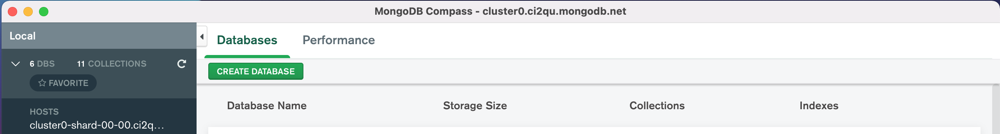
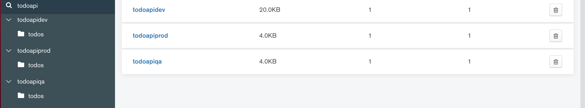

# Kubernetes "Demo": Deploy Multiple Environments of the "Todoapi"

Our k8s sample app, the `todoapi`, has been rather too simple so far.
In this demo, we'll work on making it a bit more real-life realistic in a couple of ways:
We'll add config to support a real cloud database,
and we'll add config to support deploying to multiple deploy environments.

This will allow us to use and better understand labels, ConfigMaps, Secrets, and Namespaces.

## Goals

* Support a cloud database for the `todoapi` by adding database configuration to its `deployment.yaml`.
* Configure our `todoapi` deployment to allow us to deploy 3 different environments: `dev`, `qa`, and `prod`, each with its own cloud database. We'll iterate our approach for supporting multiple environments, starting with a crude hard-coded setup, working towards an increasingly more sophisticated setup:
  * hard-coded container environment variables, using environment labels within the same k8s Namespace
  * ConfigMap and Secret to set container environment variables, using environment labels within the same k8s Namespace
  * ConfigMap and Secret to set container environment variables, using separate k8s Namespaces for each deploy environment
  * ConfigMap to set container environment variables, and Secret used via volume mount, using separate k8s Namespaces for each deploy environment

## Lab

### 1. Setup

Check out [this branch](https://github.com/us-learn-and-devops/todoapi/tree/add-cloud-db) of the `todoapi` repo in us-learn-and-devops GitHub.

Run the `/build/cluster-deploy.sh` script (or equivalent) to get your k8s cluster up and running.

### 2. Cloud Database with Crude Hard-Coded Config

The previous version of our `todoapi` sample app used an in-memory DB. This updated version uses a cloud [mongoDB](https://github.com/us-learn-and-devops/todoapi/blob/add-cloud-db/internal/domain/storage/mongodb.go).

I've created 3 databases using the [MongoDB Atlas](https://www.mongodb.com/cloud/atlas) free tier. Each database is identical except that each is intended to be used for a different deploy environment (once we configure `todoapi` to support multiple deploy environments):

* `todoapidev` database for our `dev` environment
* `todoapidqa` database for our `qa` environment
* `todoapiprod` database for our `prod` environment

Each database contains just a single mongoDB "collection" for the `todoapi`'s todos: Each `todo` object has a `name` and a `description`.

To support the new cloud DB, we will need to supply [5 DB-config values](https://github.com/us-learn-and-devops/todoapi/blob/add-cloud-db/configs/settings.go#L8-L12) to the app when it runs. Currently, the app is set up to read those values from its environment when it launches as a container in k8s. So our task is to ensure that the container environment has values for the following variables when it launches:

* **DB_HOSTNAME** (the DNS name or IP address of the cloud database server)
* **DB_DBNAME** (the name of the database containing our "todo" data on that database server)
* **DB_TODOS_COLLECTION** (the name of the mongoDB "collection" containing our "todo" data in the database)
* **DB_USERNAME** (the username our `todoapi` uses to authenticate with the database server)
* **DB_PSWD** (the password our `todoapi` uses to authenticate with the database server)

Any of these values could be different for our `dev` vs `qa` vs `prod` deploy environments.

The DB_USERNAME and DB_PSWD are also "secret" values that we need to protect from being shared publicly.

Our first approach to supporting these environment values when the `todoapi` container deploys will be crude: We'll simply hard-code them into the `env` key of our `deployment.yaml`'s container spec:

        apiVersion: apps/v1
        kind: Deployment
        metadata:
            name: todoapi-dev
            labels:
                app: todoapi
                env: dev
        spec:
            replicas: 1
            selector:
                matchLabels:
                app: todoapi
                env: dev
            template:
                metadata:
                labels:
                    app: todoapi
                    env: dev
                spec:
                containers:
                    - name: todoapi
                    image: brandallk/gotodoapi:wipaug4
                    imagePullPolicy: Always
                    ports:
                        - containerPort: 8080
                    env:
                        - name: DB_HOSTNAME
                        value: "cluster0.ci2qu.mongodb.net"
                        - name: DB_DBNAME
                        value: "todoapidev"
                        - name: DB_TODOS_COLLECTION
                        value: "todos"
                        - name: DB_USERNAME
                        value: " <redacted> "
                        - name: DB_PSWD
                        value: " <redacted> "

***This will work, but you can never commit this file to version control and push it to remote without risking exposing the DB_USERNAME and DB_PSWD.***

This does, however, get us one step along the path to supporting multiple environments.

### 3. Multiple Deploy Environments

Check out the [1.0.0 tagged release](https://github.com/us-learn-and-devops/todoapi/tree/1.0.0) of `todoapi` and open the `/build/k8s` folder to see what this looks like.

*(Note: Because this code was committed to version control, I used the values `" <redacted> "` as placeholders for DB_USERNAME and DB_PSWD instead of real values. I'll share the username/password with you privately if you'd like to connect to the cloud DB.)*

The `/build/k8s` folder contains sub-folders for each (`dev`, `qa`, and `prod`) deploy environment, because the `deployment.yaml` and `service.yaml` files must be unique for each environment.

That's true not only because of the unique DB-config `env` for each environment, but also because we're currently deploying each environment to the same ("default") namespace within our k8s cluster: We haven't yet created or used custom namespaces, so everything is deploying into the default namespace.

To differentiate the todoapi `deployment` and `service` for the `dev` environment from the todoapi `deployment` and `service` for the `qa` or `prod` environments, we need to do 2 things:

* make sure each is [labeled with an `env` label](https://github.com/us-learn-and-devops/todoapi/blob/1.0.0/build/k8s/dev/deployment.yaml#L7) matching the environment name
* make sure each has a unique name, which we're doing by adding [a suffix](https://github.com/us-learn-and-devops/todoapi/blob/1.0.0/build/k8s/dev/deployment.yaml#L4) to the metadata name

If you add in non-redacted DB_USERNAME and DB_PSWD [here](https://github.com/us-learn-and-devops/todoapi/blob/1.0.0/build/k8s/dev/deployment.yaml#L33-L36), [here](https://github.com/us-learn-and-devops/todoapi/blob/1.0.0/build/k8s/qa/deployment.yaml#L33-L36), and [here](https://github.com/us-learn-and-devops/todoapi/blob/1.0.0/build/k8s/prod/deployment.yaml#L33-L36), you can go to the `build/k8s` folder and run the [deploy.sh](https://github.com/us-learn-and-devops/todoapi/blob/1.0.0/build/k8s/deploy.sh) script to deploy each environment:

* Run `./deploy.sh dev` to deploy the dev environment
* Run `./deploy.sh qa` to deploy the qa environment
* Run `./deploy.sh prod` to deploy the prod environment

If you want to clean up any of these deployed environments, you can run the [destroy.sh](https://github.com/us-learn-and-devops/todoapi/blob/1.0.0/build/k8s/destroy.sh) script to do so. This takes advantage of the `app` and `env` labels we added to each deployed resource to selectively delete them from the cluster:

* Run `./destroy.sh dev` to delete the dev environment
* Run `./destroy.sh qa` to delete the qa environment
* Run `./destroy.sh prod` to delete the prod environment

### 4. Add a ConfigMap for DB Non-Private Config Values

We'll make our database configuration more sophisticated by creating a [ConfigMap](https://kubernetes.io/docs/concepts/configuration/configmap/).

Check out the [1.1.0 tagged release](https://github.com/us-learn-and-devops/todoapi/tree/1.1.0) of `todoapi` and take a look at the `/build/k8s` [config.yaml](https://github.com/us-learn-and-devops/todoapi/blob/1.1.0/build/k8s/dev/config.yaml) manifests in the dev, qa, and prod folders.

We'll use [these values](https://github.com/us-learn-and-devops/todoapi/blob/1.1.0/build/k8s/dev/deployment.yaml#L27-L41) in an updated version of our `deployment.yaml` for the given environment.

This allow us to supply the non-private DB_HOSTNAME, DB_DBNAME, and DB_TODOS_COLLECTION values to each of our deploy environments. Those values are unique to a given deploy environment, so we need one `config.yaml` each for the `dev`, `qa`, and `prod` environments.

A `ConfigMap` is not encrypted. That's fine for the non-private B_HOSTNAME, DB_DBNAME, and DB_TODOS_COLLECTION values, but not for the private DB_USERNAME and DB_PSWD. For these, we'll use a k8s Secret.

### 5. Add a K8s Secret for Private DB Config Values

Kubernetes provides the [Secret](https://kubernetes.io/docs/concepts/configuration/secret/) object type to hold encrypted config data. As k8s docs state:

        Secrets are similar to ConfigMaps but are specifically intended to hold confidential data.

There are [eight different types](https://kubernetes.io/docs/concepts/configuration/secret/#secret-types) of k8s Secret. We will use the default "generic" type to store our private database-config values. (Later on, we'll see other types -- docker-registry, tls, and service-account-token -- in action.)

A `Secret` can be created via kubectl from a literal value or from a file. In the 1.1.0 tagged release of `todoapi`, I've given an example of creating the secret for each deploy environment using two files in a local "secrets" folder, called "dbusername" and "dbpswd", respectively.

I've committed these files to the remote repo with the values "<redacted>" as an example. But in real life you would NEVER commit these secret files to version control or push them to a remote repo. You would likely do one of two things:

* Create these secret files locally and use them, locally, to create a Secret in your k8s cluster; then delete the local files.
* Store the secrets in a secrets manager or your pipeline's secure CI/CD secret variables setup so you could use them at deploy time to create the k8s Secret without needing the secret values themselves stored locally or anywhere else. In GitHub, we could do this using GitHub [encrypted secrets](https://docs.github.com/en/actions/reference/encrypted-secrets), for example.

To complete the simple illustation of how to create a Secret for our DB_USERNAME and DB_PSWD, I've included a couple lines in the [deploy.sh](https://github.com/us-learn-and-devops/todoapi/blob/1.1.0/build/k8s/deploy.sh#L6-L8) file for each deploy environment that will create the Secret from the files in the local "secrets" folder.

These Secret values are then harvested in the deploy environment's [deployment.yaml](https://github.com/us-learn-and-devops/todoapi/blob/1.1.0/build/k8s/dev/deployment.yaml#L42-L51) to set the environment variables "DB_USERNAME" and "DB_PSWD".

The Secret for each deploy environment is (potentially, at least) unique, like the ConfigMap for each environment. So there must be one for `dev`, `qa`, and `prod`.

This will now work, and you can deploy each of the three environments to your cluster's default namespace by running the `deploy.sh` scripts for each environment as shown above in section 3.

But note that this simple Secrets setup requires some important adjustments before it is really secure:

* Secret values *can* be harvested as environment variables, as we've done here. But it is more secure to use them as a volume mount in your container. We haven't done this yet because we haven't talked about volume mounts yet, but that is on our todo list.
* You need to [configure your k8s cluster](https://kubernetes.io/docs/tasks/administer-cluster/encrypt-data/) to encrypt Secrets data at rest using a master encryption key. If you don't do this, your Secrets are not really secure. If you are using AWS EKS to create your k8s cluster, you can use AWS's KMS (Key Management Service) to create a master encryption key for the cluster [as of March 2020](https://aws.amazon.com/blogs/containers/using-eks-encryption-provider-support-for-defense-in-depth/). This is pretty simple: You use [KMS](https://docs.aws.amazon.com/kms/latest/developerguide/overview.html) to create a key and key alias. Then you can use `eksctl` to apply [KMS envelope encryption](https://eksctl.io/usage/kms-encryption/) for your EKS cluster. This can be done either when creating the cluster or afterward.
* You should ensure that your cluster's user's Secrets and encryption-management access control is limited appropriately. This requires configuring user's [RBAC rules](https://kubernetes.io/docs/reference/access-authn-authz/authorization/), which we haven't covered yet.

### 6. Add Namespaces for Each Deploy Environment

It's a bit crude and tedious to rely on our `env` labels and object-metadata names like [todoapi-dev](https://github.com/us-learn-and-devops/todoapi/blob/1.1.0/build/k8s/dev/deployment.yaml#L4) or [todoapi-qa](https://github.com/us-learn-and-devops/todoapi/blob/1.1.0/build/k8s/qa/deployment.yaml#L4) to differentiate our different deploy environments and prevent the objects that belong to each from colliding with one another.

Let's create a unique k8s [namespace](https://kubernetes.io/docs/concepts/overview/working-with-objects/namespaces/) for each or our `dev`, `qa`, and `prod` environments. Then we can remove those `env` labels and unique object-metadata names. We can even re-use the same `deployment.yaml` and `service.yaml` manifests for each environment.

Check out the [1.2.0 tagged release](https://github.com/us-learn-and-devops/todoapi/tree/1.2.0) of `todoapi` and take a look at the `/build/k8s` folder.

Each environment folder now contains a [namespace](https://github.com/us-learn-and-devops/todoapi/blob/1.2.0/build/k8s/dev/namespace.yaml) manifest that is included in the environment's [deploy.sh script](https://github.com/us-learn-and-devops/todoapi/blob/1.2.0/build/k8s/deploy.sh#L6-L7).

Note that the (private and non-private) database config is now the only thing, other than the namespace manifests themselves, that must now be unique for each environment: Everything else can now use shared files to deploy each environment.

### 7. Next Steps:

Before we finish this example, we need to finish a couple of details. These include...

* Consuming the database-config Secret for each environment via a volume mount rather than via environment variables (as noted briefly above)
* Creating and using a different type of k8s Secret, a [docker-registry](https://kubernetes.io/docs/concepts/configuration/secret/#docker-config-secrets) Secret, to enable us to push our `todoapi` Docker image to a private, not public, image registry and consume it from there when we deploy the app to our k8s cluster
